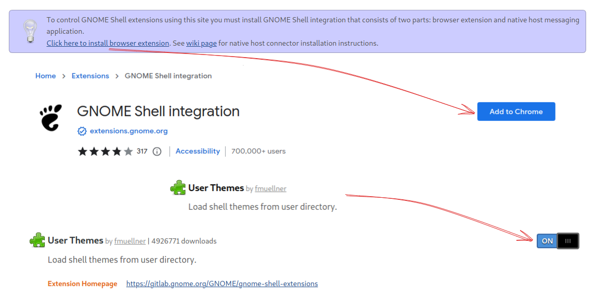
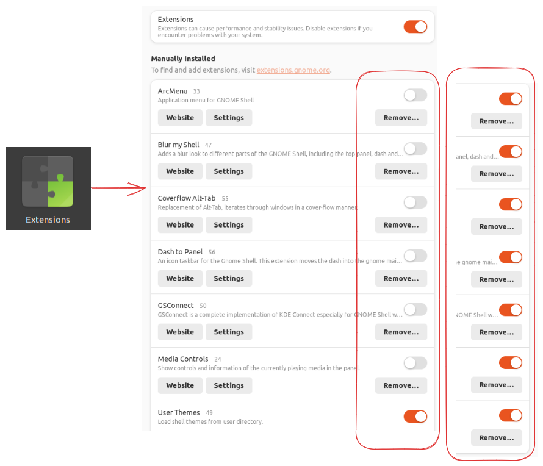
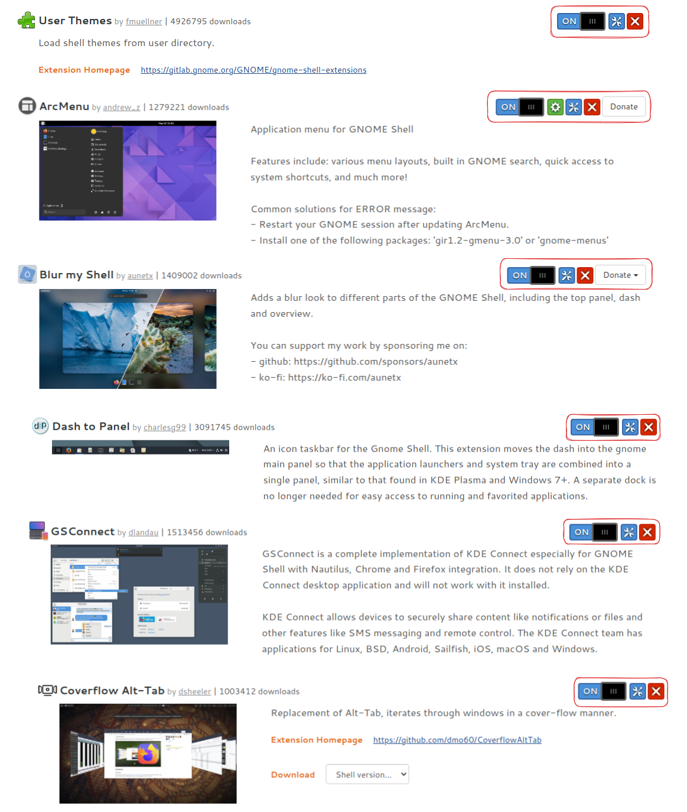

# Ubuntu 22.04 Customization

## Installing dependencies & Updates

```bash
sudo apt update
sudo apt full-upgrade
sudo apt -y install gnome-tweaks
sudo apt -y install gnome-shell-extensions
```

## Gnome extensions:

wWe have to go to [https://extensions.gnome.org/](https://extensions.gnome.org/) and do the changes to set up the *Gnome Extensions*:



## Download resources

We need this resources:

Resources 1:

- [WhiteSur-gtk-theme-master.zip](resources/WhiteSur-gtk-theme-master.zip)
- [Reversal-icon-theme-master.zip](resources/Reversal-icon-theme-master.zip)
- [Vimix-cursors-master.zip](resources/Vimix-cursors-master.zip.zip)
- [media-controls-main.zip](resources/media-controls-main.zip)

Resources 2:
- [arcmenu-config.zip](resources/arcmenu-config.zip)
- [conky-config.zip](resources/conky-config.zip)
- [dash-to-panel-config.zip](resources/dash-to-panel-config.zip)
- [extensions.zip](resources/extensions.zip)
- [fonts.zip](resources/fonts.zip)
- [media-control-config.zip](resources/media-control-config.zip)
- [wallpapers-pack.zip](resources/wallpapers-pack.zip)
- [all-extensions-config.zip](resources/all-extensions-config.zip)

```bash
## Cloning repository:
git clone https://github.com/Ramixter/ubuntu-22.04-custom.git
cd ubuntu-22.04-custom/

## Unzip resources:
#### Resources1:
unzip resources/WhiteSur-gtk-theme-master.zip -d resources/
unzip resources/Reversal-icon-theme-master.zip -d resources/
unzip resources/Vimix-cursors-master.zip -d resources/
unzip resources/media-controls-main.zip -d resources/
### Resources 2:
unzip resources/arcmenu-config.zip -d resources/
unzip resources/conky-config.zip -d resources/
unzip resources/dash-to-panel-config.zip -d resources/
unzip resources/extensions.zip -d resources/
unzip resources/fonts.zip -d resources/
unzip resources/media-control-config.zip -d resources/
unzip resources/wallpapers-pack.zip -d resources/
unzip resources/all-extensions-config.zip -d resources/

## Installing WhiteSur-gtk-theme-master
cd resources/WhiteSur-gtk-theme-master/
./install.sh -t red
# ./install.sh
cd ../..

## Installing Reversal-icon-theme-master
cd resources/Reversal-icon-theme-master/
./install.sh -red
# ./install.sh
cd ../..

## Installing Fonts
cp -r resources/fonts ~/.local/share

## Installing Vimix-cursors-master
cd resources/Vimix-cursors-master/
./install.sh
cd ../..

### Vimix-cursors-master
mkdir -p $HOME/.icons
rm -rf ~/.local/share/icons/Vimix-cursors
rm -rf ~/.local/share/icons/Vimix-white-cursors
mv ~/.local/share/icons/Vimix-cursors ~/.icons
mv ~/.local/share/icons/Vimix-white-cursors ~/.icons

## Installing Extensions
cd resources/extensions/
cp -r * ~/.local/share/gnome-shell/extensions
cd ../..
```

Now we restart the Operating System so that the changes are applied correctly. We can do it through GUI or with the command:

```bash
sudo reboot
```

## Configuring Theme:

### Extensions

Now we will have to configure the extensions that we have installed previously.



> Note: check that *Gnome extensions* and the other extensions are turned on
> 

### Media Controls

> We will have to go to the repository where we have copied the github repository to copy the `media-controls-main` file into the directory `.local/share/gnome-shell/extension/`, and we will have to name it `mediacontrols @cliffniff.github.com`

```bash
# cd ubuntu-22.04-custom/
cp -r resources/media-controls-main/ ~/.local/share/gnome-shell/extensions/mediacontrols@cliffniff.github.com
```

Now we restart the Operating System so that the changes are applied correctly. We can do it through GUI or with the command:

```bash
sudo reboot
```

### All extensions config

> We will have to go to the repository where we have copied the github repository

```bash
# cd ubuntu-22.04-custom/
cd resources/all_extensions_config/
dconf load /org/gnome/shell/extensions/< all_extension_settings.conf
```

Now we restart the Operating System so that the changes are applied correctly. We can do it through GUI or with the command:

```bash
sudo reboot
```
